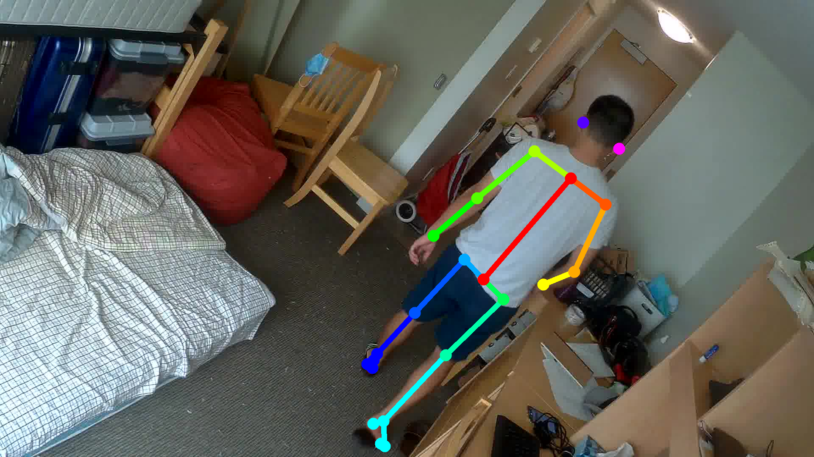
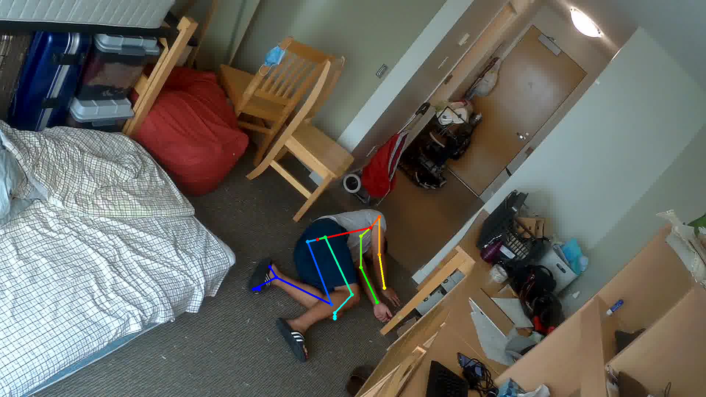
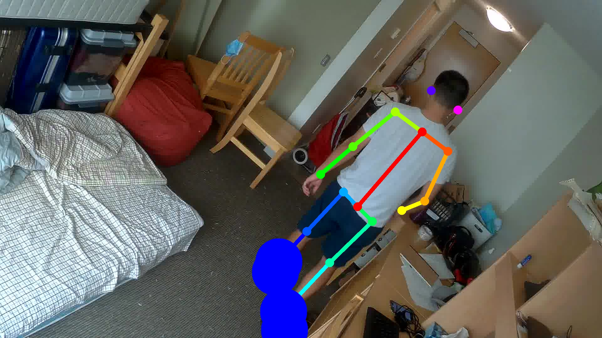
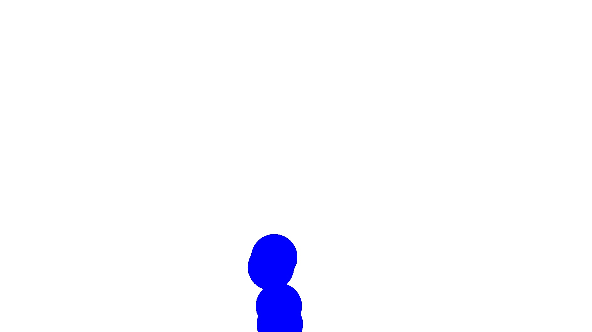
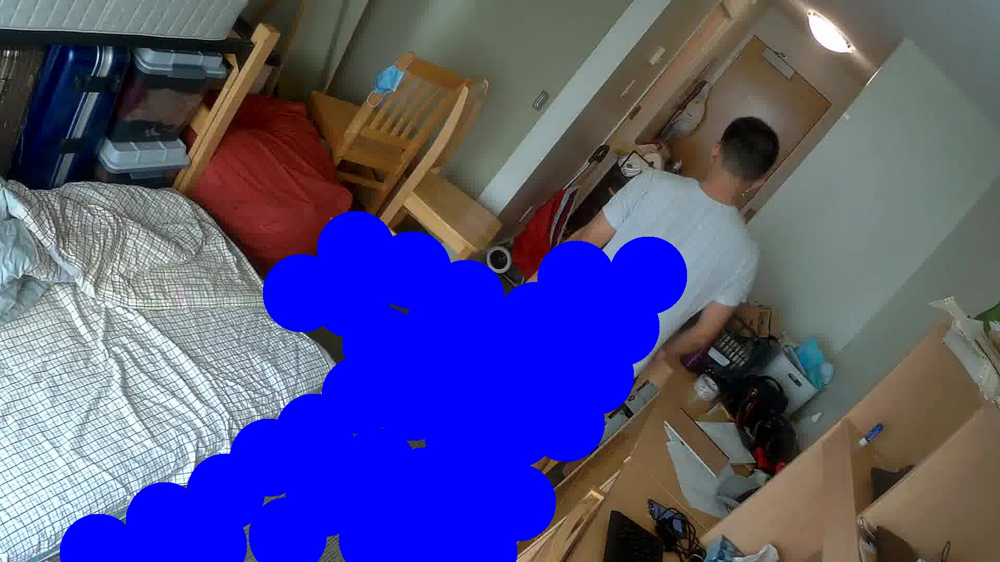
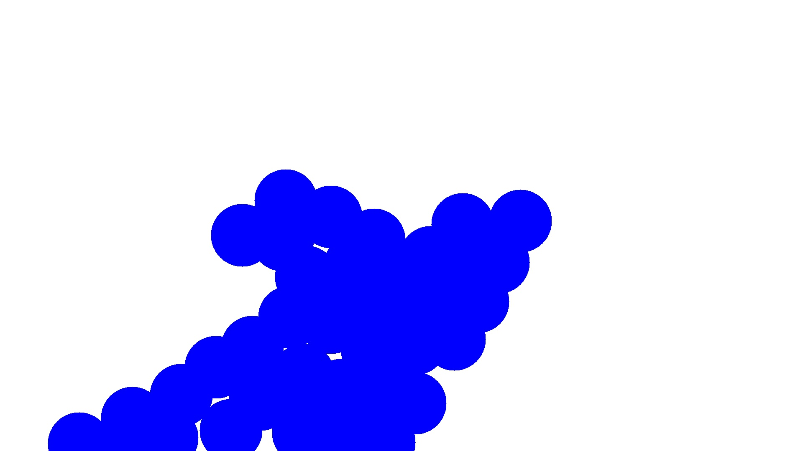

# Fall-detection-project
Designed a fall detection project using machine learning.
# Introduction
A fall detection project using Tensorflow Object Detection API, Openpose and OpenCV.
The project will be read an image that is captured from web camera. Then the image will go through a machine learning model to determine whether the person in the image is standing， seating or lying. After that, the image will be processed by Openpose to generate the join keypoints of the human being. These join keypoints will be used to do the fall detection or mark the ground area of the image.
## Project details: step by step
**1. The web camera will captured a picture and store the pictrue to the local assigned foloder. Then the image will be process by a trained machine learning model to detect the posture of the human being in the image.**

 On the left are the input pictures and on the right are the output pictures of the machine learning model.
  
  

  
  

**2. The image is sent to the Openpose to generate the join keypoints of human being. This will produce a Json file that contains all the join keypoints of humans in the image.**

  pictures show the join keypoints after processing by the Openpose
   
  
  

**3. The Json that is produced by the Openpose contains the xy coordinates of the join keypoints in the image. It will be used for two different purposes.**

  Opempose output join keypoints indices
   
  
   
  source from :https://github.com/CMU-Perceptual-Computing-Lab/openpose#quick-start

1. Draw ground area: 
When the machine learning model detects the person in the image is standing, the Json file will be used to mark the ground area of the image. We will extract the feet coordinates from the Json file and mark these coordinates in the ground.jpg with blue circle. The ground.jpg is a white background image with the same size as the input image.

 
  <kbd>
   
  
</kbd>

The program will keep drawing the ground area when the person is walking around the room. After a while, we will have a completed ground area that was marked in blue in the ground.jpg. 

 
  <kbd>
   
  
</kbd>

2. Fall detection: 
After we have the target ground area, we will able to perfrom the fall detection. When the machine learning model detects a person is lying, we will extract 
