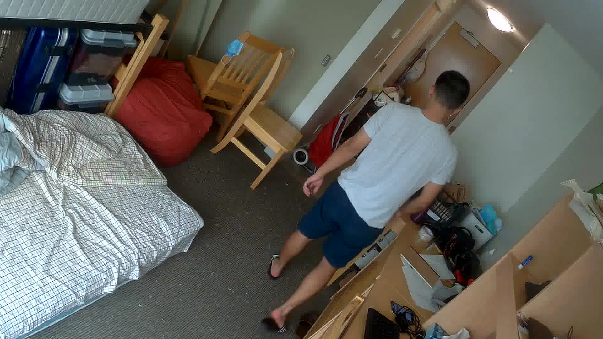
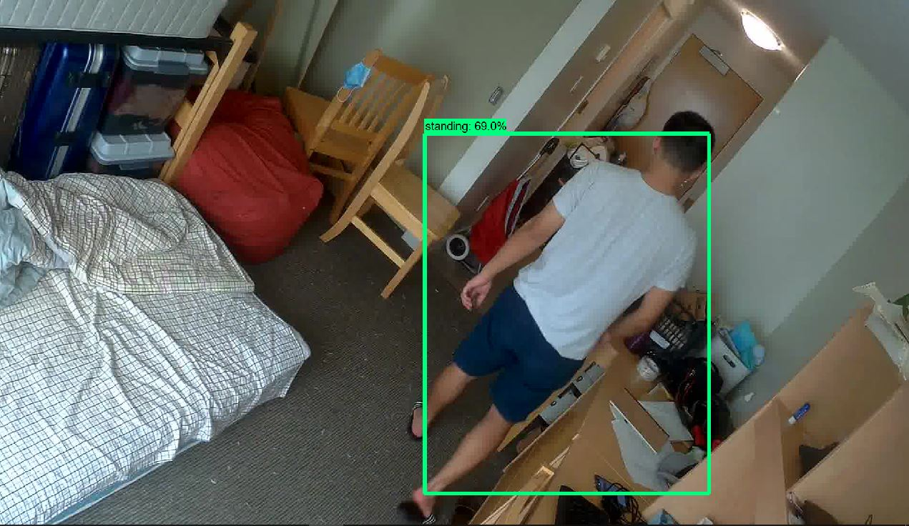
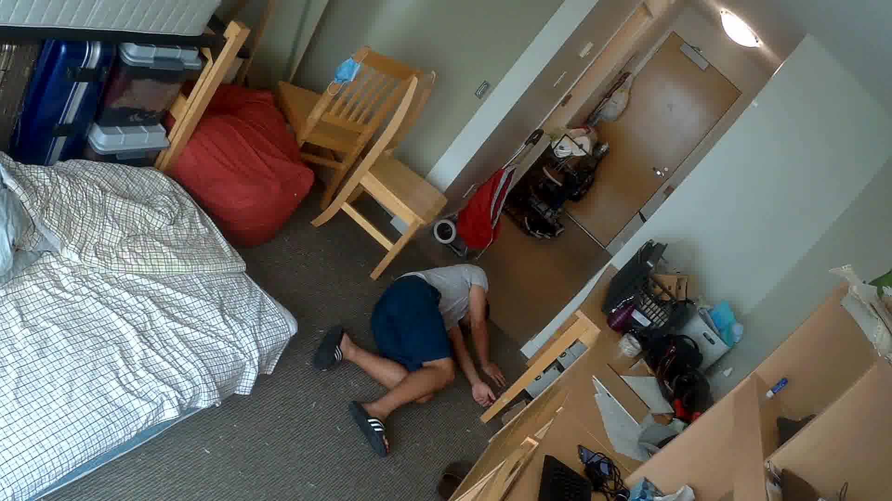
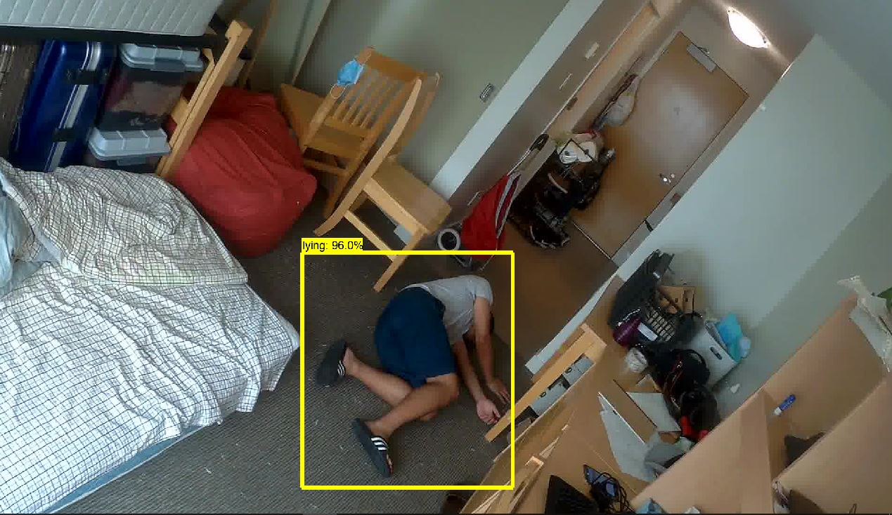

# Fall-detection-project
Designed a fall detection project using machine learning.
# Introduction
A fall detection project using Tensorflow Object Detection API, Openpose and OpenCV.
The project will be read an image that is captured from web camera. Then the image will go through a machine learning model to determine whether the person in the image is standing， seating or lying. After that, the image will be processed by Openpose to generate the join keypoints of the human being. These join keypoints will be used to do the fall detection or mark the ground area of the image.
## Project details: step by step
1. The web camera will captured a picture and store the pictrue to the local assigned foloder. Then the image will be process by a trained machine learning model to detect the posture of the human being in the image.

As you can see below, on the left are the input pictures and on the right are the output pictures of the machine learning model.

  
  

  
  

2. The image is sent to the Openpose to generate the join keypoints of human being. This will produce a Json file that contains all the join keypoints of humans in the image.

pictures show the join keypoints after processing by the Openpose

  
  

